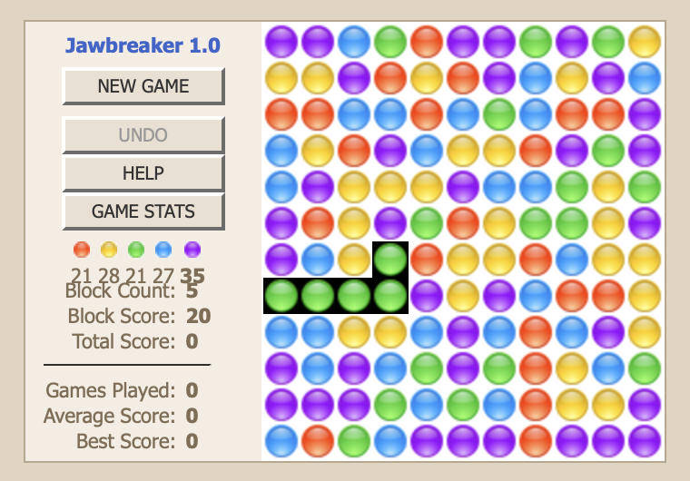

## Jawbreaker 2005

I wrote Jawbreaker back in 2005.  The web hosting service went out of 
business somewhere along the way (was it Textdrive??) and I lost the 
code.  However, some gaming website had copied it, and are still 
hosting it. The Javascript still works, ancient as it is.  The backend 
has been lost-in-time, probably was PHP with MySQL as the datastore.

Remember adding some advertising to the page and making $75-$300 per
month for close to a year.  Unfortunately, Google changed advertising 
algorithms and making significantly less thereafter. The Javascript is 
ancient, using the `prototype.js` library (don't remember that), that 
provides a **Ajax** library.  The code for this version is archived 
here for posterity.

If I were to rewrite this, I'd remove the reliance on Prototype.js, 
write a new backend (to keep track of scores), and replace the GIFs 
with Emojis.  For example, the red gif 
 could be 
replaced with the red emoji: 🔴 (or stylized CSS).  

Steve Spencer  
August, 2024

🟣🔵🟢🔴🟡

**NOTE** I have since reimplemented Jawbreaker twice:

1. using modern JavaScript in the [jawbreaker-2024](https://github.com/sspencer/jawbreaker-2024) repo
2. on the server-side in Go, using [Datastar](https://data-star.dev/) in the [jawbreaker](https://github.com/sspencer/jawbreaker) repo 

